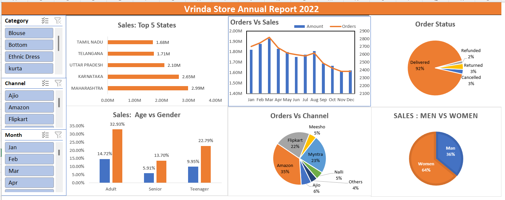

# 🛍️ Vrinda Store Annual Report 2022 – Excel Dashboard

## 📊 Overview

This dashboard presents a detailed analysis of Vrinda Store’s sales and order data for the year **2022**. It was built using **Microsoft Excel**, utilizing **data cleaning, pivot tables, and pivot charts** to derive actionable insights for the business owner.

---

## 🧭 Purpose

The dashboard aims to help the store owner quickly assess business performance through visual insights. Key questions addressed:

- 📈 Which month had the highest sales and orders?
- 🧍 Who purchased more — men or women in 2022?
- 📦 What are the different order statuses?
- 🌍 Which top 10 states contributed most to the sales?
- 🧑‍🤝‍🧑 What’s the relationship between age and gender based on order numbers?
- 📲 Which sales channel is contributing the most?
- 🛒 What is the highest-selling category?

---

## 📐 Features

- **Interactive Pivot Charts**: Pie charts and bar graphs to showcase trends and comparisons.
- **Cleaned & Structured Data**: Raw data processed using Excel formulas and transformations.
- **Clear KPI Breakdown**: Demographic, geographic, and channel-based analysis.

---

## 🧠 Key Findings

- 👩 Women made **~65%** of the purchases.
- 🌆 **Maharashtra, Karnataka, and Uttar Pradesh** together contributed **~35%** of the total sales.
- 👨‍🦱 The **30-49 years** age group contributed **~50%** of the sales.
- 🛍️ **Amazon, Flipkart, and Myntra** drove **~80%** of the total sales.

---

## ✅ Final Recommendation

To increase sales, **target women aged 30-49** living in **Maharashtra, Karnataka, and Uttar Pradesh** with **ads, offers, or coupons** available on **Amazon, Flipkart, and Myntra**.

---

## 📷 Dashboard Preview

_**Image Placeholder**_  

---

## 🔗 Excel File

[Download Dashboard Excel File](https://1drv.ms/x/c/DC852961FE5B10CB/EfyGCCWLF6dAj6zQ3q7uKdkBWGXvbyBCG9IauT6wKWxrpA?e=JCENKo)

---

## 👤 Author

**Agamjot Singh**  
_Data Analyst _

